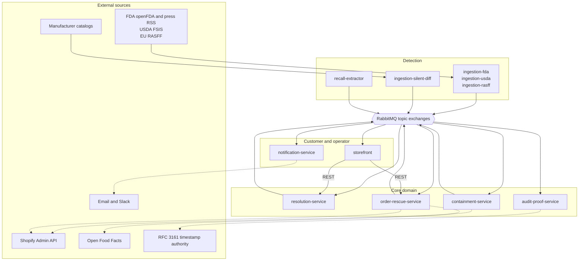
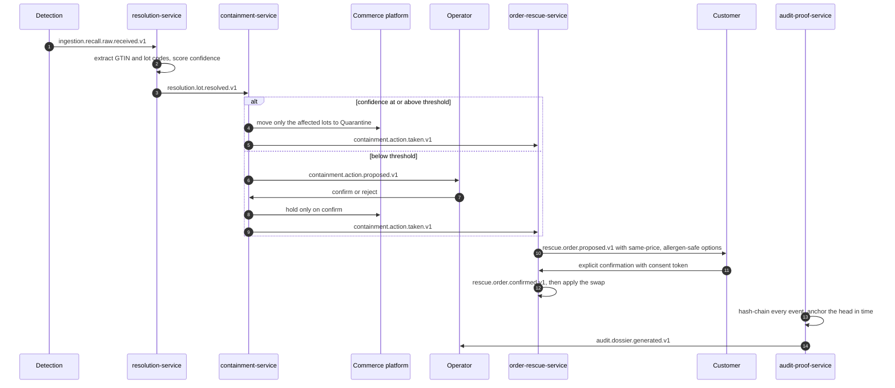
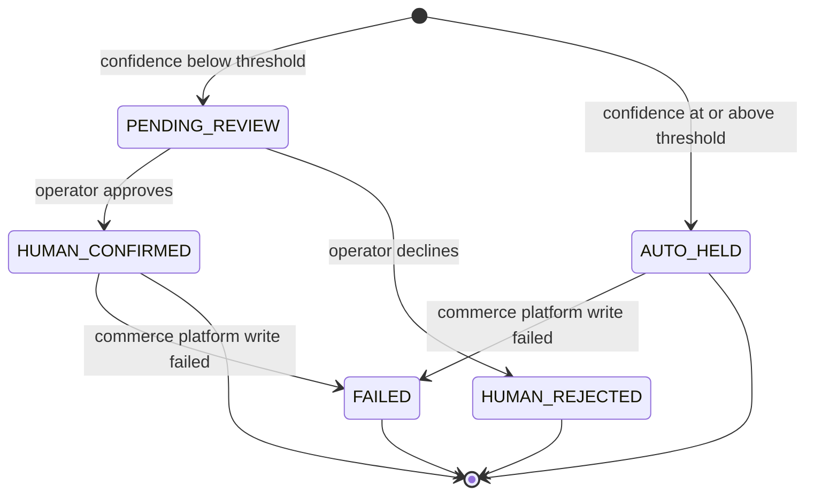
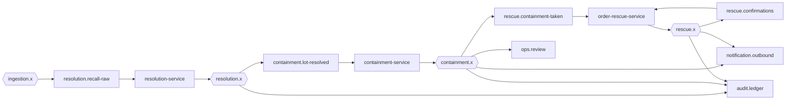

# Sotería

Predictive recall intelligence and surgical containment for food retail.

When a food safety recall is announced, most retailers learn of it late and then pull the entire
product line, destroying stock that was never contaminated. Sotería narrows both failures: it watches
multiple agency feeds continuously, resolves a notice down to the exact lot codes affected, holds only
those lots, offers affected customers a verified substitute rather than a silent cancellation, and
produces a tamper-evident record of every step.

Full product requirements: [`docs/prd.md`](docs/prd.md).

## Table of contents

1. [How it works](#how-it-works)
2. [System architecture](#system-architecture)
3. [Incident lifecycle](#incident-lifecycle)
4. [Repository map](#repository-map)
5. [Services](#services)
6. [External integrations](#external-integrations)
7. [Messaging](#messaging)
8. [Design rules](#design-rules)
9. [Running the system](#running-the-system)
10. [Testing](#testing)
11. [Configuration](#configuration)
12. [Current status](#current-status)

## How it works

A recall notice says something like "lot 8H-1132 is contaminated", not "every unit ever made". A shop
holding 125 units across three lots should withdraw the 65 units in the affected lots and keep selling
the other 60. Doing that requires three things the notice does not provide directly: which catalog
product it refers to, which lots the shop actually holds, and enough confidence to act without a human.

Sotería resolves the first two, scores the third, and acts only above a threshold. Below it, a person
decides. Everything that happens is recorded in a hash chain so the sequence can be proven later.

## System architecture



Plain arrows are asynchronous events. Dotted arrows are outbound calls to external systems.

## Incident lifecycle



Containment follows a strict state machine, so every incident ends in one defensible outcome:



## Repository map

| Path | Contents |
|---|---|
| `contracts/` | Event JSON Schemas, OpenAPI specifications, RabbitMQ topology registry |
| `libs/feedkit/` | Shared module for feed connectors: poll loop, dedup store, AMQP publisher, health and metrics |
| `libs/shopify/` | Shopify Admin GraphQL client, in-memory fake, and the lot-level hold adapter |
| `libs/core/` | Shared module for the domain services: event bindings, messaging seam, matching confidence, commerce and enrichment interfaces, HTTP middleware |
| `services/ingestion-fda/` | openFDA enforcement reports and FDA press RSS |
| `services/ingestion-usda/` | USDA FSIS recalls covering meat, poultry and egg products |
| `services/ingestion-rasff/` | EU RASFF notifications, from the public feed or portal exports |
| `services/ingestion-silent-diff/` | Python: diffs manufacturer catalogs to catch SKUs withdrawn without a notice |
| `services/recall-extractor/` | LLM entity extraction with a deterministic guardrail, for notices whose structured fields are empty |
| `services/resolution-service/` | Recall text to GTIN and lot codes, with confidence and evidence |
| `services/containment-service/` | Threshold policy, lot-level inventory hold, operator review queue |
| `services/order-rescue-service/` | In-flight order rescue with allergen-safe substitutes and explicit consent |
| `services/audit-proof-service/` | Hash-chained incident ledger, RFC 3161 timestamping, dossier as JSON and PDF |
| `services/notification-service/` | Customer email and operator alerts, with a delivery ledger |
| `apps/storefront/` | React and TypeScript storefront: safe-lot badge, allergen panel, recall banner, rescue flow |
| `automation/n8n-workflows/` | Scheduled health checks and alerting glue |
| `infra/` | Compose stack, declarative broker topology, topology drift tests |
| `tools/demo/` | Single-process harness that runs the whole chain without a broker |
| `tests/e2e/`, `tests/integration/` | Cross-service flow tests, and tests against a real broker |
| `docs/` | PRD, core domain design notes, handoff notes, security review |

## Services

| Service | Port | Responsibility | API specification |
|---|---|---|---|
| `resolution-service` | 8081 | Resolves notices to GTIN and lot codes, scores confidence with evidence, answers the safe-lot query | `contracts/openapi/resolution-api.v1.yaml` |
| `containment-service` | 8082 | Applies the auto-hold threshold, writes the hold, serves the review queue and live threshold tuning | `contracts/openapi/containment-api.v1.yaml` |
| `order-rescue-service` | 8083 | Finds affected in-flight orders, proposes substitutes, applies a swap only after consent | `contracts/openapi/order-rescue-api.v1.yaml` |
| `audit-proof-service` | 8085 | Hash-chains every event, anchors the chain head in time, renders the dossier | `contracts/openapi/audit-api.v1.yaml` |
| `notification-service` | 8084 | Delivers customer and operator messages, records proof of delivery | see service README |
| ingestion services | 8080 each | Poll agency feeds, normalize, publish, deduplicate | `contracts/events/recall.raw.received.v1.json` |

### Detection

Three agencies, four sources. The FDA press feed is the earliest signal; openFDA enforcement reports
are the structured record that follows days or weeks later; FSIS covers meat, poultry and egg products
that the FDA does not; RASFF is the European early warning. Silent catalog diffing catches products
withdrawn quietly, with no notice filed anywhere.

### Resolution

Extracts barcodes (validated by check digit, normalized to GTIN-14) and lot or batch codes from free
notice text, scores every catalog product, and publishes the result with a per-match evidence trail.
A resolution that recovers no lot codes is marked `SKU` scope so containment can treat it more
cautiously.

### Containment

Confidence at or above the threshold results in an immediate hold of the named lots. Anything lower is
queued for an operator. A reviewer may narrow the held lots but never widen them. Every outcome,
including a rejection, is published with per-target results.

### Order rescue

Scans in-flight orders for lines carrying an affected lot and offers substitutes at the identical price
whose allergen profile is verified, plus a refund and a cancel option. Nothing is swapped until the
customer confirms with a valid consent token.

### Audit and proof

Binds to every exchange carrying incident activity and appends each event to a per-incident hash chain.
Each record's hash covers its position, identity, timestamp, producer and payload hash, together with
its predecessor's hash, so altering, reordering, inserting or deleting a record breaks every hash after
it. The chain head is submitted to an RFC 3161 timestamp authority, which establishes that the content
existed by a given date. Output is JSON and a PDF suitable for an insurer or a regulator.

## External integrations

| Service | Used for |
|---|---|
| openFDA | Food enforcement reports and press releases |
| USDA FSIS | Meat, poultry and egg recalls |
| EU RASFF | European rapid alert notifications |
| Open Food Facts | Ingredient and allergen enrichment |
| Shopify Admin GraphQL API | Catalog, lot-level inventory holds, order editing |
| RFC 3161 timestamp authority | Anchoring the audit chain in time |
| Groq | LLM entity extraction for unstructured notices |
| Resend and Slack | Customer email and operator alerts |
| RabbitMQ | Event transport |
| n8n | Scheduled health checks and alerting glue |

## Messaging

Exchanges are organized one per bounded context, and routing keys follow
`<context>.<subject>.<action>.<version>`.



Two message formats coexist. Ingestion events are flat, carrying their metadata alongside their data.
Events produced by the core domain services are enveloped, with a correlation id holding the incident
id and a causation id holding the event that caused them, so an entire incident can be reconstructed
from the bus alone. Consumers adapt at the boundary, so both reach handlers the same way.

Delivery is at-least-once. Consumer queues are quorum queues with a delivery limit, so the broker
counts attempts and dead-letters a message once the budget is spent. Handlers deduplicate on event id,
and incidents deduplicate on a deterministic incident id that survives producer restarts.

The full registry of exchanges, queues, bindings and dead-letter routing is
[`contracts/rabbitmq-topology.md`](contracts/rabbitmq-topology.md).

## Design rules

- **Lot scope is the product.** A `SKU` scope resolution faces a higher threshold than a lot-level
  hold. Removing an entire product line should be harder than removing a lot.
- **Confidence must be explainable.** Every match carries weighted evidence, so a reviewer and an
  auditor read the same reasoning.
- **An unidentified lot is not a safe lot.** The lot status endpoint returns `UNKNOWN_LOT` rather than
  `SAFE` when it cannot place a unit against a live incident.
- **Consent is structural.** The confirm endpoint validates an HMAC token and publishes the
  confirmation event; the swap is applied by the event handler, so an API call and a replayed event
  follow the same single-writer path.
- **Missing data is unsafe data.** A substitute with incomplete allergen coverage is refused. Open Food
  Facts omits allergen tags for products nobody has annotated, which is indistinguishable from a
  product that genuinely has none.
- **Fixture mode is never silent.** Every service logs which backend it is using, and a partially
  configured store refuses to start. An event claiming a hold that never happened is worse than a
  service that will not start.
- **Nothing is dropped.** Every consumer queue has a dead-letter pair, and the audit ledger binds to
  every exchange carrying incident events.

## Running the system

### Whole stack with a broker

```sh
cd infra
cp .env.example .env     # optional: credentials, thresholds
docker compose up -d
```

This starts RabbitMQ with the topology imported at boot, plus the four core domain services on ports
8081 to 8085. The management UI is on 15672.

### Without a broker

`tools/demo` hosts the core domain services in one process on an in-process bus, which is convenient
for developing the storefront or demonstrating the flow on a machine without Docker.

```sh
cd tools/demo && go run .                  # :8081 to :8085, plus :8090
cd apps/storefront && npm install && npm run dev   # :5173
```

Inject a recall notice and watch the chain run:

```sh
curl -X POST localhost:8090/demo/notice -H 'Content-Type: application/json' -d @notice.json
curl localhost:8090/demo/state | python -m json.tool
```

### Detection services

```sh
cd services/ingestion-fda && make dry-run ARGS="--backfill-days 14"   # print, publish nothing
make once ARGS="--backfill-days 14"                                   # publish one pass
make run                                                              # long-running poller
```

Every connector accepts `--once`, `--dry-run`, `--backfill-days`, `--interval`, `--db`, `--http`,
`--rabbitmq` and `--log-level`.

### Verifying an incident

```sh
curl "localhost:8081/v1/lots/status?gtin=<gtin>&lot_code=<lot>"   # SAFE, AFFECTED or UNKNOWN_LOT
curl "localhost:8082/v1/containment/actions?status=PENDING_REVIEW" # operator review queue
curl "localhost:8083/v1/rescues?order_id=<order>"                  # options offered to a customer
curl "localhost:8085/v1/dossiers/<incident>/verify"                # recompute the hash chain
curl "localhost:8085/v1/dossiers/<incident>.pdf" -o dossier.pdf    # the document itself
```

## Testing

Each module is independent, with its own `go.mod` and CI job. `go.work` ties them together for local
development.

```sh
for m in libs/feedkit libs/shopify libs/core \
         services/ingestion-fda services/ingestion-usda services/ingestion-rasff \
         services/notification-service services/recall-extractor \
         services/resolution-service services/containment-service \
         services/order-rescue-service services/audit-proof-service \
         tests/e2e tests/integration tools/demo infra; do
  (cd $m && go vet ./... && go test ./...)
done
```

Three layers of test guard different failures:

- **Contract tests** validate produced events against the JSON Schemas in `contracts/`, so schema drift
  fails in CI rather than at a consumer.
- **`tests/e2e`** wires the core domain services onto one in-process bus and asserts the whole chain:
  surgical containment, the review queue path, live threshold tuning, redelivery idempotence, refusal
  of a forged consent token, and reporting of a commerce platform failure.
- **`tests/integration`** exercises a real broker: routing, the flat and enveloped message boundary,
  dead-lettering under a failing handler, and idempotent queue declaration on redeploy. It skips
  without `RABBITMQ_URL`, and CI runs it against a RabbitMQ service container.

`infra/rabbitmq/topology_test.go` compares three descriptions of the same topology that can otherwise
drift silently: the registry in `contracts/`, the broker definitions, and what the services subscribe
to on boot.

## Configuration

Everything is environment-driven, and every service degrades explicitly rather than silently.

| Variable | Effect |
|---|---|
| `RABBITMQ_URL` | Unset runs on an in-process bus, logged at startup |
| `SHOPIFY_SHOP`, `SHOPIFY_ACCESS_TOKEN` | Both or neither. Unset uses bundled fixtures and logs that holds are not real; setting one alone is a startup error |
| `QUARANTINE_LOCATION` | Location affected lots are moved to, default `Quarantine` |
| `AUTO_HOLD_THRESHOLD`, `SKU_SCOPE_THRESHOLD` | Confidence cutoffs, tunable at runtime through the containment API |
| `CONSENT_SECRET` | HMAC secret for customer consent tokens |
| `TSA_URL`, `TSA_DISABLED` | Timestamp authority for the audit chain |
| `CORS_ALLOWED_ORIGINS` | Origins allowed to call the APIs from a browser; empty disables CORS |
| `GROQ_API_KEY` | Enables LLM extraction; without it the extractor serves cache hits and replays |

Before deploying anywhere shared, read [`docs/security-review.md`](docs/security-review.md), which
lists the known open items in order of severity.

## Current status

Working and verified against live sources:

- All three agency feeds return real data, and a run of 166 live notices produced no false positives
  and no dead letters.
- Lot-level containment through the real hold adapter: in the reference scenario, 65 units are
  withdrawn and 60 units of unaffected stock remain sellable.
- Storefront badge, recall banner and consent-gated rescue flow against live service APIs.
- Audit chain verification, RFC 3161 timestamping against public authorities, and PDF rendering.
- The broker path is exercised in CI against a real RabbitMQ instance.

Known gaps:

- The audit ledger is held in memory, so its integrity guarantees do not survive a restart. Durable
  append-only storage is the prerequisite for treating a dossier as evidence.
- Anti-evasion monitoring of resale marketplaces is specified but not implemented.
- The operator console exists as APIs only; there is no user interface for the review queue or the
  dossier archive.
- Commerce integration has not been exercised against a live store, only against the in-memory
  implementation of the same interface.
