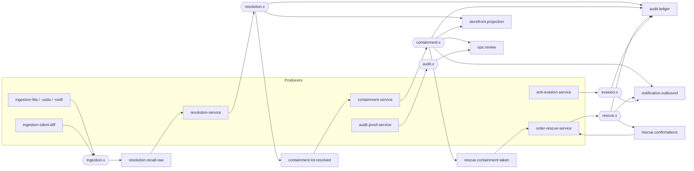

# RabbitMQ topology registry

Owned by the core domain workstream. Producers append their exchanges and routing keys here via pull
request; consumers own their queues and bindings. If an exchange, queue or routing key is not listed
here, it does not exist.

Conventions (PRD 6.3): one durable **topic** exchange per bounded context; routing key
`<context>.<subject>.<action>.<version>`, where `<context>` is the publishing exchange without its
`.x` suffix; nobody publishes into another service's queue; every consumer queue has a dead-letter
exchange owned by the consumer.

## Topology at a glance

Each queue also has a `<queue>.dlq` bound to its owning context's dead-letter exchange
(`resolution.dlx`, `containment.dlx`, `rescue.dlx`, and so on).

## Exchanges

| Exchange | Type | Durable | Declared by | Notes |
|---|---|---|---|---|
| `ingestion.x` | topic | yes | ingestion services (idempotent `ExchangeDeclare`) and infra | Recall feed events and silent catalog-diff signals |
| `resolution.x` | topic | yes | resolution-service and infra | Lot-level resolutions |
| `containment.x` | topic | yes | containment-service and infra | Proposed and executed containment actions |
| `rescue.x` | topic | yes | order-rescue-service and infra | Order rescue proposals and customer confirmations |
| `evasion.x` | topic | yes | anti-evasion-service and infra | Recalled lots resurfacing on resale marketplaces |
| `audit.x` | topic | yes | audit-proof-service and infra | Generated incident dossiers |
| `notification.x` | topic | yes | notification-service and infra | Outbound delivery records |
| `<context>.dlx` | topic | yes | infra and the consuming service | Dead letters for that context's queues |

## Routing keys

| Routing key | Schema | Producer(s) | Status |
|---|---|---|---|
| `ingestion.recall.raw.received.v1` | [`events/recall.raw.received.v1.json`](events/recall.raw.received.v1.json) | `ingestion-fda`, `ingestion-usda`, `ingestion-rasff` | live |
| `ingestion.catalog.sku.vanished.v1` | [`events/catalog.sku.vanished.v1.json`](events/catalog.sku.vanished.v1.json) | `ingestion-silent-diff` | proposed, consumer ready |
| `resolution.lot.resolved.v1` | [`events/lot.resolved.v1.json`](events/lot.resolved.v1.json) | `resolution-service` | live |
| `containment.action.proposed.v1` | [`events/containment.action.proposed.v1.json`](events/containment.action.proposed.v1.json) | `containment-service` | live |
| `containment.action.taken.v1` | [`events/containment.action.taken.v1.json`](events/containment.action.taken.v1.json) | `containment-service` | live |
| `rescue.order.proposed.v1` | [`events/order.rescue.proposed.v1.json`](events/order.rescue.proposed.v1.json) | `order-rescue-service` | live |
| `rescue.order.confirmed.v1` | [`events/order.rescue.confirmed.v1.json`](events/order.rescue.confirmed.v1.json) | `order-rescue-service`, on behalf of the storefront | live |
| `evasion.flagged.v1` | [`events/evasion.flagged.v1.json`](events/evasion.flagged.v1.json) | `anti-evasion-service` | proposed |
| `audit.dossier.generated.v1` | [`events/audit.dossier.generated.v1.json`](events/audit.dossier.generated.v1.json) | `audit-proof-service` | proposed |
| `notification.delivered.v1` | [`events/notification.delivered.v1.json`](events/notification.delivered.v1.json) | `notification-service` | live — on `notification.x`; proposed consumer binding: `audit.ledger` (add `notification.x` / `#`) so the dossier can cite deliveries |

## Message formats

Two formats coexist on the bus, deliberately:

- **Inbound ingestion events are flat.** `ingestion.recall.raw.received.v1` carries its metadata
  (`event_id`, `event_type`, `version`, `occurred_at`, `producer`) alongside its data, per the schema
  owned by the ingestion services.
- **Events produced by the core domain services are enveloped.** They use
  [`events/_envelope.v1.json`](events/_envelope.v1.json), whose `correlation_id` carries the incident
  id and whose `causation_id` carries the id of the event that caused them, so an entire incident can
  be reconstructed from the bus alone.

Consumers in the core domain layer adapt at the boundary (`libs/core/events.InboundEnvelope`), so a
flat message and an enveloped one reach handlers the same way.

Message properties on every publish: `content_type=application/json`, `delivery_mode=persistent`,
`message_id=<event_id>`, `app_id=<producer>`, `timestamp=<occurred_at>`. Ingestion publishes also set
`type=recall.raw.received`.

## Queues and bindings

| Queue | Owner | Bound to | Binding keys |
|---|---|---|---|
| `resolution.recall-raw` | resolution-service | `ingestion.x` | `ingestion.recall.raw.received.*`, `ingestion.catalog.sku.vanished.v1` |
| `containment.lot-resolved` | containment-service | `resolution.x` | `resolution.lot.resolved.v1` |
| `rescue.containment-taken` | order-rescue-service | `containment.x` | `containment.action.taken.v1` |
| `rescue.confirmations` | order-rescue-service | `rescue.x` | `rescue.order.confirmed.v1` |
| `audit.ledger` | audit-proof-service | `resolution.x`, `containment.x`, `rescue.x`, `evasion.x` | `#` on each; the audit service records everything |
| `notification.outbound` | notification-service | `containment.x`, `rescue.x`, `evasion.x` | `containment.action.taken.v1`, `rescue.order.proposed.v1`, `evasion.flagged.v1` |
| `storefront.projection` | storefront backend | `resolution.x`, `containment.x` | `resolution.lot.resolved.v1`, `containment.action.taken.v1` |
| `ops.review` | ops console backend | `containment.x`, `audit.x` | `containment.action.proposed.v1`, `audit.dossier.generated.v1` |

## Delivery semantics

- **At-least-once.** Producers mark a notice as seen only after the broker confirms the publish, so a
  crash between publish and mark can re-emit the same `source_id` with a new `event_id`. Consumers
  dedupe on `event_id` and, for recall notices, on the derived incident id (`source` plus `source_id`),
  which survives producer restarts.
- Messages are persistent and consumers acknowledge only after the handler commits.
- Retry budget: a failing handler is rejected with requeue until the `x-death` depth reaches
  `x-max-retries: 5`, after which the message is dead-lettered for good. Nothing is dropped silently,
  because the audit trail's completeness depends on it.

## Declaration order

Infra declares exchanges and dead-letter pairs. **Each service declares its own queues and bindings on
boot** with idempotent `queue.declare` and `queue.bind`, so a service can be deployed without an infra
change.

## Versioning

A breaking payload change ships as `<key>.v2` published **alongside** `.v1` from the same producer
until every consumer listed above has migrated, after which the `.v1` binding is removed in a
follow-up pull request. Additive optional fields do not bump the version.
